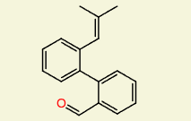

# Q2MM

A library that allows off-the-shelf computation of Transition State Force Field (TSFF) for organic molecules using Bayes Optimization.


## Theory

Transition states play a crucial role in the kinetics of any chemical reaction. It is the difference in Free Energy between the reactants and transition state that ultimately determines (up to the limits of diffusion), how quickly a reaction can occur.

Previously, most transition state analysis relied on Density Functional Theory (DFT). However, DFT tends to scale badly for larger molecules: a molecule with twice as many electrons will take roughly 8 times longer to compute.

Enter Molecular Mechanics. A framework of molecular simulation that simulates iteratomic interactions through the use of force fields. This has been used to simulate everything from gas diffusion to melting / freezing points to supercritcal fluids.

### Force Fields

Force fields are a series of equations used to calculate the energy of a system, and which way the forces of the system will be pushing it. For example, the two simplest types of force field equations are Leonard-Jones and bond forces, which take the following form:

$$ V(r) = 4 \epsilon [(\frac{\sigma}{r})^{12} - \frac{\sigma}{r})^{6})$$

$$ V(r) = K (r - r_0)^2$$

Both these equations relate the potential energy based on the distance between two atoms as a function of distance r between them. 

However, these equations both have a large number of parameters that depends on the atom, molecular structure, electronic environment, and several others. Choosing the right force field parameter is hard, and much work has gone into tuning them, and nowadays, most libarys like OpenMM will automatically generate a reasonably good force field for you.

However, most force fields are not tuned for transition states, only molecules. To find the right parameters for a TSFF, we need to tune it ourselves, and that's what this library does.

### Q2MM

Q2MM stands for "Quantum-Guided Molecular Mechanics" (I'm not sure where the 2 comes from). The general principle is to use QM to calculate the transition state of a small system, fit a TSFF to it, and then apply the TSFF to a larger molecule where DFT calculations would be very long and costly.

The specific parameters we will tune will be the $K$ value of the bond equations for the partial bonds. We can observe from the original DFT calculation what $r_0$ should be for each partial bond, so all we actually have to do is calculate a $K$ value for each partial bond, and then we'll have our TSFF.

_Note: Force fields only have one equation for each bond, even if that bond is a double or triple bond. Some reactions, including the example provided, will have a transition state where 1 bond in double bond is partial and the other a full bond. However, the program will treat the entire full bond-partial bond group as a single partial bond whose $K$ value must be tuned._

### Using Bayes Optimization for Tuning Parameters

Bayes optimization is a mathematical program designed for modelling black box functions. They can be directed to either model the function as a whole as accurately as posible, or to try to find the optimal (minimum) point of the function. This library does the latter.

Say our transition state has 4 partial bonds. Then, we need to optimize for 4 $K$ values. Our "function" will therefor have 4 inputs.

Our loss will be based on how accurately our MM simulation recreates the geometry of the known transition state. We will consider each atom's position in our simulation, compare it with the position in the DFT calculated transition state. Our loss will then be calculated for the following:

$$\frac{\sum_0^n \sqrt{(\hat{x_i} - \hat{x_i'})^2}}{n}$$

Where n is the number of atoms in our system, $\hat{x_i}$ is the DFT calculated position of atom $i$, and $\hat{x_i'}$ is the position of the atom in the Molecular Mechanics Simulation.

Thus, our function is complete. Our inputs are K values, and our loss is the root mean squared of the difference in position between each atom.

_Note: Since we care about geometry, rather than actual positions themselves, we need to make our loss function translationally and rotationally invariant. This library will take care of that automatically._


## Instalation and Initial Testing

### Conda

To install the conda env, run the following:

```
conda env create -f environment.yml
conda activate q2mm-openmm
```

### Testing Bayes optimization

Run the following:

```
bash run_bo.sh square_sin
```


This will try to optimize the following function:

$$ F(x, y) = (x- 4.8)^2 +  2 * (\sin(y))^2$$

### Testing the molecular mechanics

Run the following:

```
python get_graph.py --smiles "CC(C)=Cc1ccccc1c2ccccc2C=O"
bash run_bo.sh q2mm "CC(C)=Cc1ccccc1c2ccccc2C=O"
```

This will optimize the TSFF of the following molecule as it undergoes a 2+2 reaction with itself.



## Using Custom Molecules

This library is designed to work off-the-shelf. So you don't need to do any coding to use this library, just put the needed files in the right place.

### Needed information

To use this library on a custom molecule, you will need the following:

1. The smiles string of the molecule we are looking at.
1. A file containing the atom type of each atom in the molecule called "Atoms.csv.
1. A file containing all the bonds of each molecule called "Bonds.csv".
1. A file containing the initial position of each atom "initial_pos.csv".
1. A file containing the target position of each atom "target_pos.csv".
1. A file containing a list of bonds we want to tune called "modified_bonds.csv".

All these files should be placed into a folder that is named for the smiles string of the molecule in question. The provided example is for the molecule with smiles "CC(C)=Cc1ccccc1c2ccccc2C=O", so all the information needed is stored in "Raw_Molecule/CC(C)=Cc1ccccc1c2ccccc2C=O".

_Note: in each file, the labelling must be consistent. Atom number 1 should refer to the same atom in EVERY above file._

_Note 2: Do NOT include a header line in any csv files._

#### Smiles string
This doesn't need to be in a file. The name of the directory everything is kept in should be named for this.

#### Atom types.

Here are the first few lines of the provided examples Atoms.csv:

```
1,6
2,6
3,6
4,6
5,6
6,6
```
The left value is the index of the atom, the right value is the atomic number (so, all atoms you see above are carbons).


#### Bonds

Here are the first few lines of provided Bonds.csv:

```
1,2
1,6
1,20
2,3
2,7
3,4
3,8
4,5
```

Both values refer to atoms. Thus, the first line means "atoms 1 and 2 share a bond".

#### Initial Postion
Here are the first few lines of provided initial_pos.csv:

```
1,0.1735612,-0.2207123,-0.0011230
2,0.0914617,-0.1060194,-0.0114803
3,0.1558811,0.0202943,-0.0268327
4,0.2967176,0.0268091,-0.0263867
5,0.3760158,-0.0877677,-0.0120786
6,0.3133972,-0.2125727,-0.0003063
```

The first value is an index which refers to a specific atom, the rest are its x, y, and z positions initally. This refers to the initial position of the atom at the start of our simulation. 

The best way to get this is the starting position from your DFT calculation.

#### Target Position
Here are the first few lines of provided target_pos.csv:

```
1,0.1945036,-0.2064989,-0.0002879
2,0.1000233,-0.1020576,-0.0119431
3,0.1481583,0.0306437,-0.0265421
4,0.2864734,0.0553093,-0.0271031
5,0.3789210,-0.0491698,-0.0130628
6,0.3321347,-0.1808372,-0.0001447
```

It is the same form as initial positions. The first value is the index, the next 3 are x, y, and z positions.


#### Modified Bonds

Here are the first few lines of provided modified_bonds.csv:

```
9,19,0.24100492249018482
8,17,0.16490954889347675
9,8,0.14809143719020354
17,19,0.1345190260703295
```


The first 2 lines are atom indexes. The 3rd value is the known distance between the atoms in the final target geometry.


#### Putting it all together

Once you've created all 5 files, put them all in a folder named for the smiles string, and put that folder in Raw_Molecules.

Then, type the following command into the terminal:

```
python get_graph.py --smiles [SMILES]
```

For example, if your smiles is "CCC#N", type the following:

```
python get_graph.py --smiles "CCC#N"
```

This is needed because atom indicies are arbitrary, and there's a very good chance that OpenMM's indexing formula will give different indexes than what you have. This step handles all that automatically. On top of that, it generates the files needed for to begin the bayes optimization.

### Running the program.

Once you've completed this, you're ready to start optimizing your TSFF. Just type the following into the terminal:

```
bash run_bo.sh q2mm [SMILES]
```

For example, if your smiles is "CCC#N", type the following:

```
bash run_bo.sh q2mm "CCC#N"
```

## Interpreting Results

- Files generated in BO_data.
- How to read.
- Original Files (Modify get graph).

### Explaining Generated Files

This part isn't needed to run this library. Feel free to skip to the next section.


## Interpreting Results